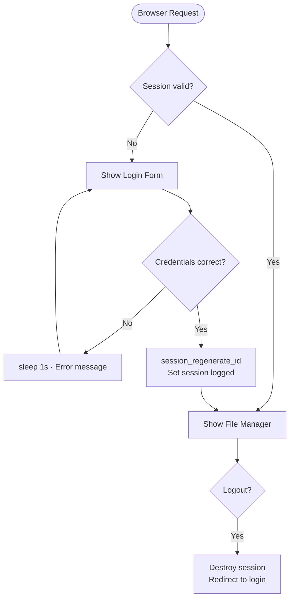
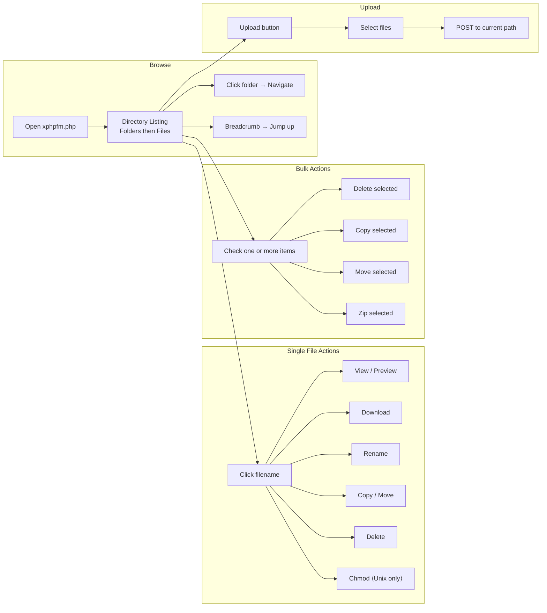
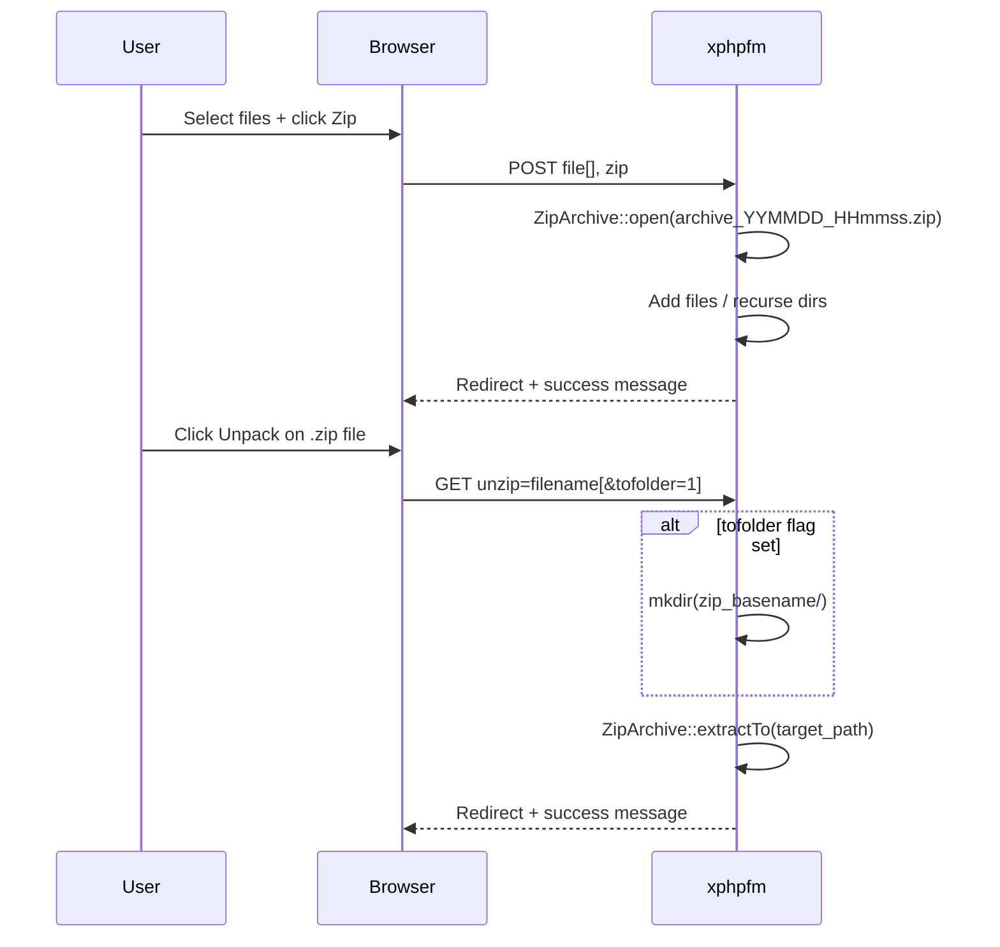

# xsukax PHP File Manager

> A lightweight, self-hosted, single-file PHP web-based file manager with built-in authentication, syntax highlighting, archive support, and full file system management — deployable in minutes.

[](https://www.gnu.org/licenses/gpl-3.0)
[](https://www.php.net/)
[](https://github.com/xsukax/xsukax-PHP-File-Manager)

---

## Table of Contents

- [Project Overview](#project-overview)
- [Security and Privacy Benefits](#security-and-privacy-benefits)
- [Features and Advantages](#features-and-advantages)
- [Installation Instructions](#installation-instructions)
- [PHP Configuration (`php.ini`)](#php-configuration-phpini)
- [Usage Guide](#usage-guide)
  - [Authentication Flow](#authentication-flow)
  - [File Operations Workflow](#file-operations-workflow)
  - [Archive Operations](#archive-operations)
  - [Embed Mode](#embed-mode)
- [License](#license)

---

## Project Overview

**xsukax PHP File Manager** is a zero-dependency, single-file (`xphpfm.php`) web-based file manager designed for developers and system administrators who need a portable, lightweight tool to manage server files directly through a browser. No database, no framework, and no external libraries are required beyond a standard PHP installation.

It provides a clean GitHub-inspired UI and covers the full spectrum of day-to-day file management tasks: browsing directory trees, uploading and downloading files, creating and renaming files and folders, moving and copying items, managing Unix permissions (`chmod`), and compressing/decompressing ZIP archives — all from a single script you can drop into any PHP-enabled web root.

The manager supports in-browser previewing of text files (with syntax highlighting via Highlight.js), images, audio, and video, making it a practical all-in-one tool without the overhead of a traditional server control panel.

---

## Security and Privacy Benefits

Security is a first-class concern in xsukax PHP File Manager. The following measures are built directly into `xphpfm.php`:

### Authentication System
- **Credential-based login wall** — access is gated behind a configurable username/password map (`$auth_users`). No unauthenticated user can browse or manipulate files.
- **Brute-force delay** — a deliberate `sleep(1)` is applied on every failed login attempt, throttling automated credential-stuffing attacks without requiring external tooling.
- **Session hardening** — upon successful login, `session_regenerate_id(true)` is called immediately to invalidate the prior session token and prevent session-fixation attacks.
- **Named session** — the session is named `filemanager` (separate from the application's default PHP session) to reduce namespace collision and exposure.
- **Authentication can be disabled only when embedded** — the `FM_EMBED` constant disables the auth layer only for deliberate programmatic embedding, preventing accidental public exposure.

### Input Sanitisation & Path Security
- All path parameters are processed through `fm_clean_path()`, which strips `..` traversal sequences, normalises separators, and trims leading/trailing slashes before any filesystem operation is performed.
- Direct manipulation of `.` and `..` filenames is explicitly blocked in every action handler (delete, rename, copy, etc.).
- All output rendered to HTML passes through `fm_enc()` (a wrapper for `htmlspecialchars`) to prevent reflected Cross-Site Scripting (XSS).

### HTTPS Detection
- The application auto-detects HTTPS (including `X-Forwarded-Proto` from reverse proxies) and constructs all internal URLs with the correct scheme, preventing mixed-content warnings and ensuring secure cookie delivery.

### No-Cache Headers
- All responses are served with strict `no-store, no-cache` headers, ensuring that sensitive directory listings and file contents are never stored in browser or proxy caches.

### Privacy by Design
- **Self-hosted** — all data stays entirely within your own infrastructure. No telemetry, analytics, or third-party tracking is present in the code.
- **No database** — no credentials, paths, or access logs are written to a secondary data store. The attack surface is limited to the single PHP file.
- The only external requests are optional CDN loads for Highlight.js (syntax highlighting), which can be disabled by setting `$use_highlightjs = false` for fully air-gapped deployments.

---

## Features and Advantages

| Capability | Details |
|---|---|
| **Single-file deployment** | Drop `xphpfm.php` into any web root — no composer, no npm, no migrations |
| **Directory browsing** | Breadcrumb navigation, natural-sort file/folder listing |
| **File upload** | Multi-file upload to the current directory |
| **File download** | Force-download via `Content-Disposition` header |
| **Create folder** | Inline prompt via JavaScript |
| **Rename** | In-page rename via JavaScript prompt |
| **Copy / Move** | Interactive folder picker for destination selection |
| **Bulk operations** | Select All / Unselect All / Invert selection for mass delete, copy, move, or zip |
| **Delete** | Single-item and bulk recursive delete for files and directories |
| **ZIP / Unzip** | Create archives from selected items; unpack to current folder or a named sub-folder |
| **Chmod (Unix)** | Visual permission editor (Owner / Group / Other × Read / Write / Execute) |
| **File viewer** | In-browser preview for text, images (`gif`, `jpg`, `png`, `webp`, `bmp`, `ico`), audio, and video |
| **Syntax highlighting** | Highlight.js 11.9 with configurable style (default: `github`) for 180+ languages |
| **Charset handling** | Auto-detects UTF-8; falls back to `iconv` conversion for legacy encodings (default: `CP1251`) |
| **MIME detection** | Extension + `finfo`/`mime_content_type` fallback for accurate type reporting |
| **Embeddable** | Define `FM_EMBED` before including to embed the manager inside your own application |
| **Responsive UI** | Mobile-friendly layout with a maximum-width wrapper and viewport meta tag |
| **GitHub-style theme** | Clean, distraction-free interface matching GitHub's design language |
| **PHP 5.6+ compatible** | Works on legacy servers without modification |

---

## Installation Instructions

### Requirements

- PHP **5.6** or later (PHP 8.x fully supported)
- Web server with PHP support (Apache, Nginx, LiteSpeed, etc.)
- PHP extensions: `session`, `zip` (for archive operations), `fileinfo` or `mime_content_type` (for MIME detection), `iconv` (for legacy charset conversion)

### Steps

**1. Download the file**

```bash
wget https://raw.githubusercontent.com/xsukax/xsukax-PHP-File-Manager/main/xphpfm.php
```

Or clone the repository:

```bash
git clone https://github.com/xsukax/xsukax-PHP-File-Manager.git
cd xsukax-PHP-File-Manager
```

**2. Upload `xphpfm.php` to your server**

Place it anywhere inside your web root, for example:

```
/var/www/html/xphpfm.php
```

**3. Configure credentials and options**

Open `xphpfm.php` and edit the configuration block at the top of the file:

```php
// Enable or disable authentication (strongly recommended: true)
$use_auth = true;

// Define users — key: username, value: password
$auth_users = array(
    'admin' => 'your-strong-password-here',
);

// Syntax highlighting theme (see https://highlightjs.org/demo for options)
$highlightjs_style = 'github';

// Server timezone
$default_timezone = 'UTC';

// Root path the manager is allowed to browse
// Defaults to DOCUMENT_ROOT — restrict further if needed
$root_path = $_SERVER['DOCUMENT_ROOT'];

// Date/time display format
$datetime_format = 'd.m.y H:i';
```

**4. Set file permissions (Unix)**

```bash
chmod 644 xphpfm.php
```

**5. Access the manager**

Open your browser and navigate to:

```
https://yourdomain.com/xphpfm.php
```

Log in with the credentials you configured. You will be redirected to the root directory listing.

> **Security tip:** After deployment, restrict access to `xphpfm.php` by IP in your web server configuration, or place it outside the public web root and proxy only authenticated sessions to it.

---

## PHP Configuration (`php.ini`)

Certain PHP runtime settings directly affect the behaviour and capabilities of the file manager. Review and tune the following directives in your `php.ini` (or via a `.htaccess` / `ini_set` override) before deploying:

| Directive | Recommended Value | Purpose |
|---|---|---|
| `file_uploads` | `On` | Must be enabled for the upload feature to function |
| `upload_max_filesize` | `256M` (or as required) | Maximum size of a single uploaded file |
| `post_max_size` | `256M` (≥ `upload_max_filesize`) | Maximum total POST body size; must be at least as large as `upload_max_filesize` |
| `max_file_uploads` | `50` | Maximum number of files that can be uploaded simultaneously |
| `max_execution_time` | `600` | The script already calls `set_time_limit(600)` — ensure the INI value permits this |
| `memory_limit` | `256M` | Required when reading or previewing large text files into memory |
| `default_charset` | `UTF-8` | Set by the application at runtime; align the INI value to prevent conflicts |
| `session.gc_maxlifetime` | `1440` (default) | Controls how long inactive sessions persist on the server |
| `session.cookie_secure` | `1` | Transmit the session cookie over HTTPS only (strongly recommended) |
| `session.cookie_httponly` | `1` | Prevent JavaScript from accessing the session cookie |
| `session.use_strict_mode` | `1` | Reject unrecognised session IDs to harden against fixation attacks |
| `extension=zip` | enabled | Required for ZIP archive creation and extraction |
| `extension=fileinfo` | enabled | Used for MIME type detection |
| `extension=iconv` | enabled | Required for legacy charset (e.g. CP1251) conversion |

Example snippet to add to `.htaccess` (Apache with `mod_php`):

```apacheconf
php_value upload_max_filesize 256M
php_value post_max_size 256M
php_value max_execution_time 600
php_value memory_limit 256M
php_flag session.cookie_secure On
php_flag session.cookie_httponly On
```

---

## Usage Guide

### Authentication Flow



### File Operations Workflow



### Archive Operations



### Navigating the Interface

**Toolbar (top-right of breadcrumb bar)**

| Icon | Action |
|---|---|
| Upload | Open the multi-file upload form |
| New Folder | Prompt for a folder name and create it |
| Logout | Terminate the session and return to the login screen |

**File listing columns**

Each row displays the file or folder name (with a type icon), last-modified timestamp, and file size. Clicking the name opens the file viewer; additional action links (View, Download, Rename, Copy, Chmod, Delete) appear beside each entry.

**Bulk selection**

Use the `Select All`, `Unselect All`, and `Invert` buttons at the bottom of the listing, or click individual checkboxes. Once items are selected, choose **Delete**, **Copy / Move**, or **Zip** from the group action bar.

**File viewer**

The viewer auto-detects the file type:
- **Text / code** files are rendered with Highlight.js syntax highlighting.
- **Images** are rendered inline.
- **Audio and video** files are played with the native HTML5 `<audio>` / `<video>` player.
- **ZIP archives** display the archive manifest (filenames, sizes, compression ratio) before offering Unpack options.

### Embed Mode

To embed the file manager inside your own PHP application, define the `FM_EMBED` constant before including `xphpfm.php`. This bypasses the authentication layer (your application is responsible for access control) and suppresses the standalone HTML shell:

```php
<?php
define('FM_ROOT_PATH', '/var/www/html/uploads');
define('FM_ROOT_URL',  'https://yourdomain.com/uploads');
define('FM_SELF_URL',  'https://yourdomain.com/admin/files.php');
define('FM_EMBED', true);
require 'xphpfm.php';
```

---

## License

This project is licensed under the **GNU General Public License v3.0** — see the [LICENSE](https://www.gnu.org/licenses/gpl-3.0.html) file for full terms.
